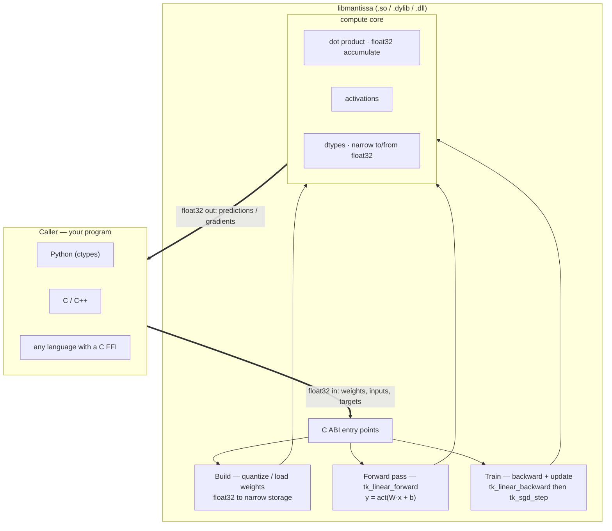

# mantissa

[](https://github.com/tekinertekin/mantissa/actions/workflows/ci.yml)


**A fast, memory-lean neural-network core in C, with a Python binding.**

`mantissa` runs neural-network layers — forward *and* backward — spending as
little time and memory per parameter as it can. That is the goal: an engine
small enough to fit big models in RAM/VRAM and fast enough to run them at scale.
A tight C core does the compute; a thin Python layer drives it.

> Started by Tekin Ertekin (2024); later refactored with Claude Code — see
> [AUTHORS.md](AUTHORS.md).

---

## How it works

`mantissa` is a shared library with a plain **C ABI**, so any language that can
call C — Python (via ctypes), C/C++, Rust, Go — drives the same engine. The
caller passes ordinary **float32** arrays in and gets float32 back; inside,
weights are kept in a narrow type to save memory.



A call is one of three kinds:

- **Build** — quantize weights from float32 into the compact storage type (once).
- **Forward pass** (`tk_linear_forward`) — compute `y = activation(W·x + b)`.
  Called *forward* because data flows forward through the network, input →
  output (also *feed-forward*). There is no "fast" in it — the opposite
  direction is the backward pass.
- **Backward pass / training** (`tk_linear_backward` → `tk_sgd_step`) —
  gradients flow backward, output → input, and the weights are updated.

Whichever it is, the compute core does the same underneath: read the narrow
weights, **accumulate in float32**, apply an activation, return float32.

## Performance at a glance

A 2048×2048 dense layer (4.2M parameters) on an Apple M-series laptop, default
bfloat16 (`make bench` / `make benchbp`):

| | value |
|---|---|
| forward pass | **0.98 ms** (8.6 GFLOP/s) |
| backward pass | **0.98 ms** (12.8 GFLOP/s) |
| weight memory | **8 MB** — half of float32 |
| `relu` over 4M values | **0.41 ms** |

Memory is the headline at scale — it decides whether a model loads at all:

| model | float32 | mantissa (bf16) | mantissa (1-byte) |
|-------|:-------:|:---------------:|:-----------------:|
| 1B params | 4.0 GB | 2.0 GB | 1.0 GB |
| 7B params | 28 GB  | 14 GB  | **7 GB** |

## How it stays small and fast

1. **Narrow weight storage** — weights are the bulk of a model, so storing each
   in 2 bytes (or 1) instead of 4 is where the RAM/VRAM savings come from, and
   since a dense layer is memory-bandwidth bound, moving fewer bytes is also
   faster. The precision is a build-time dial (below).
2. **float32 accumulation** — compute always sums in float32 so accuracy holds
   across a layer's millions of terms (mixed precision; Micikevicius 2017).
3. **Tuned kernels** — a vectorizing dot product (four independent accumulators,
   FMA, `restrict`), branchless activations (sign-bit / `fmax` / `copysign`,
   chosen by benchmark), and stochastic rounding so training survives narrow
   weights. Details and measurements in [docs/DESIGN.md](docs/DESIGN.md).

### The precision dial

Storage precision is one build-time knob (`DTYPE`); the default needs no config.
It is *how* the core trades accuracy for memory — a means to the speed/RAM goal,
not the goal itself.

| `DTYPE` | Name | Bytes | When |
|--------:|------|:-----:|------|
| 0 | `float32`  | 4 | reference / exact |
| 2 | `bfloat16` | 2 | **default** — half the RAM, training-safe |
| 1 | `fp16`     | 2 | half RAM, more precision, less range |
| 3 | `tekin32`  | 4 | custom high-fidelity accumulator |
| 4 | `tekin8`   | 1 | FP8 E4M3 — 4× smaller |
| 5 | `fp8_e5m2` | 1 | FP8, wider range |
| 6 | `fp4_e2m1` | ½ | FP4 — the extreme |

Bit layouts, the `tekin` formats' design rationale, the hot/cold conversion
split, and the current-research context (MX / NVFP4 / posit / IEEE P3109) all
live in [docs/DESIGN.md](docs/DESIGN.md). Every value is stored in the selected
type but computed in float32.

### Accuracy cost, seen

The same value stored in each format and read back (`make DTYPE=<n> test`).
This is the accuracy you trade away for the memory you save — `float32` is the
reference column:

| input   | float32 | tekin32 | fp16      | bfloat16  | e5m2 | tekin8 |
|---------|--------:|--------:|----------:|----------:|-----:|-------:|
| 3.14159 | 3.14159 | 3.14159 | 3.14062   | 3.14062   | 3.0  | 3.25   |
| 100.0   | 100     | 100     | 100       | 100       | 96   | 104    |
| 0.01    | 0.01    | 0.01    | 0.0100021 | 0.0100098 | 0.0098 | 0.00977 |

`fp4_e2m1` is coarser still: its 8 magnitudes are `{0, ±0.5, ±1, ±1.5, ±2, ±3,
±4, ±6}` — everything rounds onto that grid.

## Full benchmarks

The numbers behind *Performance at a glance*, per dtype. `make DTYPE=<n> bench` —
a 2048×2048 dense layer (4.2M params), plus the activation-dispatch micro-test.
Apple M-series laptop, clang `-O3`; indicative, not absolute.

| dtype    | weight memory | GEMV ms/pass | GEMV GFLOP/s |
|----------|:-------------:|:------------:|:------------:|
| float32  | 16.0 MB | 1.05 | 7.97 |
| bfloat16 |  8.0 MB | 0.98 | 8.57 |
| tekin8   |  4.0 MB | 3.29 | 2.55 |

Reading, honestly: `bfloat16` beats `float32` (half the bytes, bf16→float is a
single shift). `tekin8` is *slower* despite ¼ the memory — its E4M3→float
conversion (a subnormal branch, no SIMD) dominates once the matrix fits in
cache. On hardware with native FP8 conversion (F16C, AVX512-BF16, Blackwell
tensor cores) that cost disappears; here it is a candid picture of a scalar,
portable implementation.

**Backward pass** (`make DTYPE=<n> benchbp`, same 2048×2048 layer):

| dtype    | backward ms/pass | backward GFLOP/s | SGD update (M weights/s) |
|----------|:----------------:|:----------------:|:------------------------:|
| float32  | 1.03 | 12.21 | 9379 |
| bfloat16 | 0.98 | 12.83 |  994 |
| tekin8   | 3.04 |  4.14 |  298 |

**Activation dispatch** (4M elements): a per-element `switch` beats a resolved
function pointer ~7× for `relu` and ~1.5× for `sigmoid`. The inline `switch`
vectorizes (`relu` compiles to a single `fmax` per lane); an indirect call per
element does not. So `tk_activate` keeps the `switch`, and the function-pointer
API (`tk_act_resolve`) is reserved for genuinely pluggable dispatch. The
`step`/`sign`/`relu` kernels themselves are branchless (sign-bit read, `fmax`,
`copysign`), each picked by benchmark over the obvious comparison. *Measure,
don't assume.*

## Mixed architectures

Every layer configures itself independently — bias is a per-call NULL-able
pointer, activation is a per-call argument:

```c
tk_linear_forward(W1, x,  b1,   h1, 6, 4, TK_ACT_TANH);     /* bias + tanh    */
tk_linear_forward(W2, h1, NULL, h2, 5, 6, TK_ACT_RELU);     /* no bias + relu */
tk_linear_forward(W3, h2, b3,   y,  2, 5, TK_ACT_SIGMOID);  /* bias + sigmoid */
```

That is a full 3-layer MLP with three different bias/activation setups —
exactly the heterogeneity a Transformer needs (bias-free attention projections,
bias-using feed-forward). Run it: `make mlp`.

## Training (back-propagation)

The reverse pass mirrors the forward core: `tk_linear_backward` computes the
weight, bias, and input gradients for a dense layer; `tk_sgd_step` updates
narrow-stored weights; `tk_loss` (MSE / BCE) seeds the gradient. No autograd
graph — the caller drives the layers, keeping everything explicit and
inspectable.

Correctness is proven by a **gradient check** (`make testbp`): analytic
gradients vs central finite differences, matching to <1e-3 for tanh, sigmoid,
relu, and gelu.

`make train` learns **XOR** — the problem a single perceptron *cannot* solve —
end to end, in the default **bfloat16**:

```
Training XOR  (dtype=bfloat16, stochastic_rounding=1)
  epoch    0  loss 0.31523
  epoch 1000  loss 0.00035
  epoch 4000  loss 0.00007
predictions:
  (0,0) -> 0.004   (0,1) -> 0.990   (1,0) -> 0.991   (1,1) -> 0.009
```

That it converges in bf16 is the point of **stochastic rounding** (config
`TK_USE_STOCHASTIC_ROUNDING`): under plain round-to-nearest, a weight update
smaller than the storage type's precision rounds to zero and training stalls; SR
rounds up/down with probability proportional to distance, so tiny updates
accumulate in expectation (Gupta et al., 2015; the technique behind FP8 training
on Hopper/Blackwell). It needs no fp32 master copy of the weights.

Measured — same XOR run, 4000 epochs, round-to-nearest vs SR (`make DTYPE=<n> benchbp`):

| dtype    | round-to-nearest | stochastic rounding |
|----------|:----------------:|:-------------------:|
| float32  | 0.00008 | 0.00008 *(SR is a no-op)* |
| bfloat16 | 0.01090 | 0.00009 |
| tekin8   | **0.24862 — stalled** | **0.00008 — converged** |

In the 1-byte type, plain rounding never learns XOR; stochastic rounding does.
That is the whole reason the technique exists.

### Training config (all OFF by default)

| Flag | Effect |
|------|--------|
| `TK_USE_DROPOUT` / `TK_DROPOUT_RATE` | inverted dropout on activations |
| `TK_USE_L1` / `TK_L1_LAMBDA`         | L1 weight penalty in the update |
| `TK_USE_L2` / `TK_L2_LAMBDA`         | L2 weight penalty in the update |
| `TK_USE_STOCHASTIC_ROUNDING`         | SR on the weight write-back |

Each sets a default; the runtime `tk_optim` / dropout calls override per layer.
Back-propagation is scoped to the dense layer for now (the shared primitive);
conv/recurrent backward reuse the same pieces later.

## Zero-config

Never touch `config.h` and you get Google's **bfloat16** with **bias enabled** —
the safe general-purpose default. Override only when you want to:

```sh
make DTYPE=4 test     # switch storage to tekin8
```

## Download

Prebuilt shared libraries are attached to every [release](https://github.com/tekinertekin/mantissa/releases) —
built by CI for Linux, macOS, and Windows. Grab the one for your OS and load it
straight from Python, no compiler or `make` needed:

| OS | file |
|----|------|
| Linux   | `libmantissa-linux-x86_64.so` |
| macOS   | `libmantissa-macos-arm64.dylib` |
| Windows | `libmantissa-windows-x86_64.dll` |

```python
import ctypes
lib = ctypes.CDLL("./libmantissa-linux-x86_64.so")   # the file you downloaded
print(lib.tk_dtype_name.restype == None or "loaded")
```

Or use the ctypes wrapper in [`python/mantissa.py`](python/mantissa.py) (point
it at the downloaded file). To build from source instead, see below.

## Quick start

```sh
make test                     # tests, default bfloat16
make example                  # C perceptron
make mlp                      # mixed 3-layer MLP
make DTYPE=0 bench            # benchmark, float32
make dist && python3 python/perceptron_example.py
```

The Python binding is dtype-agnostic: it calls the float32 entry point, so the
same script runs against any storage type the library was built for. Full API
and examples in [docs/USAGE.md](docs/USAGE.md).

## Numeric landscape & roadmap

The low-precision frontier moves fast; `mantissa` tracks it deliberately:

- **Microscaling (MX)** — OCP MX v1.0 (2023): blocks of 32 elements share one
  E8M0 scale, mitigating the tiny dynamic range of 4/6-bit elements. `MXFP8`,
  `MXFP6`, `MXFP4`.
- **NVFP4** — NVIDIA Blackwell (2024): 16-element blocks with an FP8 E4M3 block
  scale; used to pretrain LLMs at 4 bits (arXiv:2509.25149).
- **Posit / takum** — tapered-precision alternatives to IEEE floats, strong for
  ≤8-bit inference on zero-centered weights.
- **IEEE P3109** — an emerging standard for ML arithmetic formats.

`mantissa` implements the *element* formats (E4M3, E5M2, E2M1); block-level
microscaling (a shared per-block scale) is the next planned step. **Convolution
is already within reach**: a conv layer is a batch of dot products of a filter
against input patches, and `tk_dot` is exactly that primitive — a CNN needs an
`im2col`/patch iterator on top, no new numerics. Back-propagation for the dense
layer is implemented (gradient-checked); conv/recurrent backward will reuse the
same gradient and optimizer pieces.

## Project layout

```
include/   config, dtypes + conversions, activations, ops, loss, backprop
src/       implementations
tests/     forward round-trip checks (7 formats) + backprop gradient check
examples/  perceptron, mixed-MLP, XOR training
bench/     GEMV + activation-dispatch benchmark
python/    ctypes binding + Python perceptron
docs/      DESIGN.md (numerics, optimization), USAGE.md (API + examples)
```

## License

MIT — see [LICENSE](LICENSE). © 2024 Tekin Ertekin.
